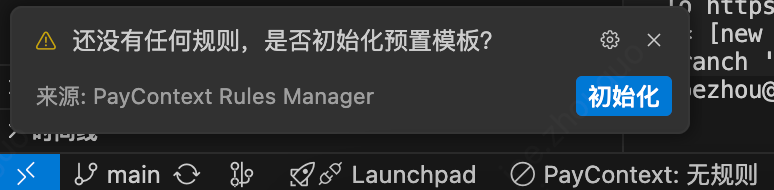
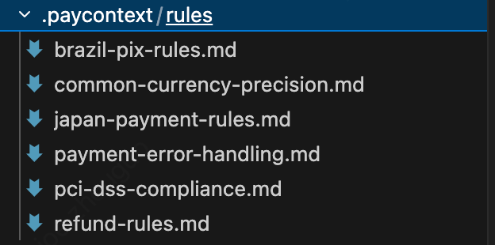
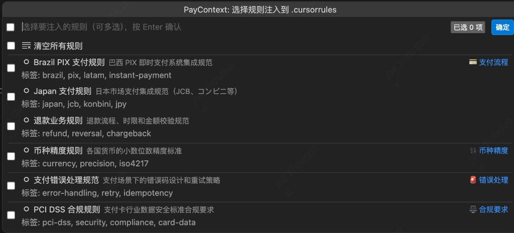
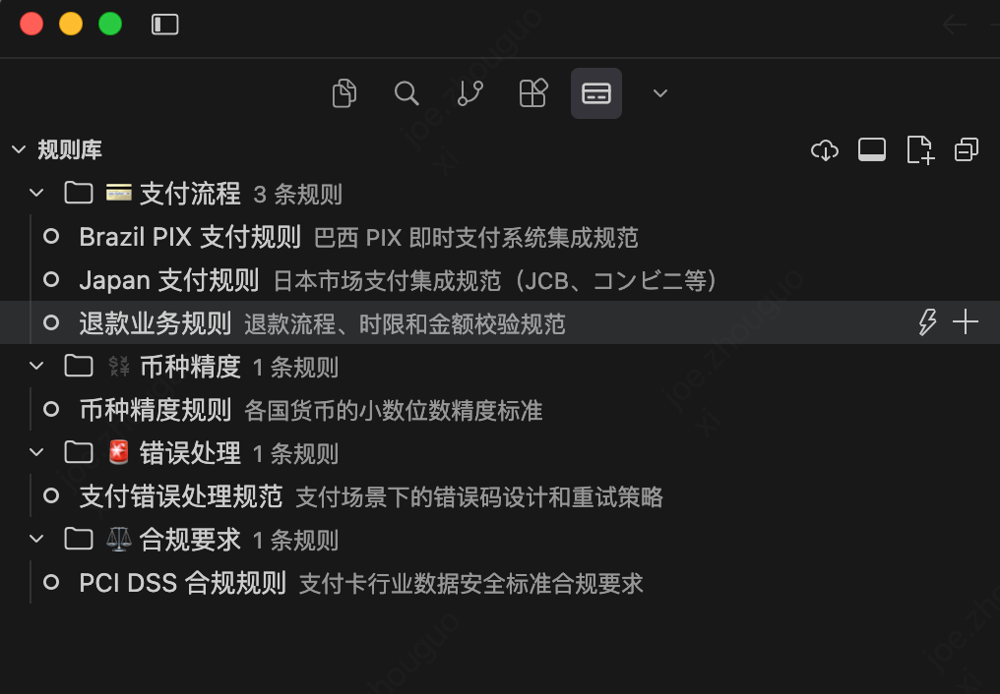

# PayContext Rules Manager

> 让 Cursor AI 自动理解你的支付业务逻辑、币种精度和合规要求。

## 工作原理

```
.paycontext/rules/          .cursorrules              Cursor AI
┌─────────────────┐  注入   ┌─────────────┐  感知   ┌──────────────┐
│ brazil-pix.md   │ ──────► │ [PayContext] │ ──────► │ 每次对话自动 │
│ currency.md     │         │  业务规则    │         │ 携带业务规则 │
│ pci-dss.md      │         │ [用户内容]  │         └──────────────┘
└─────────────────┘         └─────────────┘
```

插件**不修改 Cursor 本身**，而是通过维护项目根目录的 `.cursorrules` 文件来工作。Cursor 会实时读取该文件，在每次 `Cmd+L`（对话）和 `Cmd+K`（内联编辑）时自动带上这些规则。

## 快速开始

### 1. 安装插件

从 VS Code 扩展市场搜索 `PayContext Rules Manager` 并安装，或直接安装 `.vsix` 文件。

### 2. 初始化规则模板

首次打开项目时，插件会询问是否初始化预置规则。也可以通过命令面板执行：

```
Cmd+Shift+P → PayContext: 初始化预置规则模板
```

这会在项目目录创建 `.paycontext/rules/` 文件夹，包含 6 个内置规则模板。

**首次打开时的欢迎提示：**



**初始化后生成的规则文件目录：**



### 3. 选择并注入规则

**方法一：快捷键（推荐）**
```
Cmd+Shift+Alt+P  →  弹出规则选择面板（可多选）→ Enter 确认注入
```



**方法二：侧边栏**
- 点击左侧活动栏的 💳 图标打开 PayContext 面板
- 在"规则库"中右键规则 → "注入规则"



**方法三：状态栏**
- 点击左下角状态栏的 `⚡ PayContext: N 条规则已注入`（未注入时显示 `PayContext: 无规则`）

## 内置规则模板

| 规则名 | 分类 | 说明 |
|-------|------|------|
| 币种精度规则 | 💱 币种 | ISO 4217 各货币精度、Decimal 使用规范 |
| Brazil PIX 支付规则 | 💳 支付 | PIX Key、QR Code、回调验签规范 |
| Japan 支付规则 | 💳 支付 | JPY 精度、便利店付款、3DS 要求 |
| PCI DSS 合规规则 | ⚖️ 合规 | 卡号脱敏、Token化、日志安全 |
| 支付错误处理规范 | 🚨 错误 | 错误码体系、重试策略、幂等性 |
| 退款业务规则 | 💳 支付 | 退款类型、金额校验、状态机 |

## 注入模式

| 模式 | 行为 | 使用场景 |
|-----|------|---------|
| **替换注入** | 清除旧 PayContext 规则，写入新规则 | 切换业务场景 |
| **追加注入** | 在现有规则基础上叠加新规则 | 组合多个规则 |

## 自定义规则

点击规则库顶部的 **新建规则** 按钮，填写：
- 规则名称和描述
- 分类（支付/币种/合规/API/错误处理/测试）
- 标签（便于搜索）
- 规则内容（Markdown 格式，直接写入 .cursorrules）

规则文件保存在 `.paycontext/rules/` 目录，可以提交到 Git，实现团队共享。

## 配置项

在 VS Code 设置中搜索 `paycontext`：

| 配置项 | 默认值 | 说明 |
|-------|-------|------|
| `paycontext.rulesDirectory` | `.paycontext/rules` | 规则存储目录 |
| `paycontext.autoInjectOnOpen` | `false` | 打开项目时自动注入上次规则 |
| `paycontext.showStatusBar` | `true` | 状态栏显示当前规则 |
| `paycontext.backupCursorRules` | `true` | 注入前备份 .cursorrules |

## 团队协作

将 `.paycontext/rules/` 目录提交到 Git，团队成员 clone 项目后即可共享业务规则：

```bash
# .gitignore 建议配置
.cursorrules.backup   # 备份文件不需要提交
```

```bash
# 提交规则
git add .paycontext/rules/
git commit -m "feat: add Brazil PIX payment rules"
```

## 文件结构

```
your-project/
├── .cursorrules              ← 插件自动维护（不要手动修改 PayContext 段落）
├── .paycontext/
│   └── rules/
│       ├── .meta.json        ← 记录当前激活的规则 ID
│       ├── common-currency-precision.md
│       ├── brazil-pix-rules.md
│       └── your-custom-rule.md
```

## 常见问题

**Q: 注入后 .cursorrules 原来的内容会丢失吗？**
A: 不会。插件只管理带有 `# ===== PayContext Rules =====` 标记的段落，用户自定义内容完整保留。同时默认会备份一份 `.cursorrules.backup`。

**Q: 规则文件可以手动编辑吗？**
A: 可以。`.paycontext/rules/` 下的 `.md` 文件可以直接用编辑器修改，插件会自动检测变化并刷新。

**Q: 支持 .cursorignore 吗？**
A: 插件只写 `.cursorrules`，不影响 `.cursorignore`。
